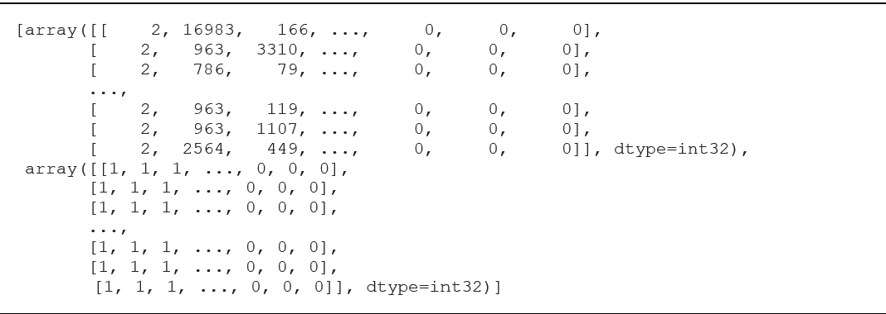

# Aspect Based Sentiment Analysis

# Daftar Isi
- [Pengumpulan Data](#pengumpulan-data)
- [Labeling Dataset](#labeling-dataset)
- [Preprocessing](#preprocessing)
  - [Case Folding](#case-folding)
  - [Punctuation Removal](#punctuation-removal)
  - [Word Normalization](#word-normalization)
  - [Stemming](#stemming)
- [Split Dataset](#split-dataset)
- [Model LSTM](#model-lstm)
- [Model CNN](#model-cnn)

# Pengumpulan Data
Teknik web scraping merupakan teknik yang dilakukan dalam proses pengumpulan data. Proses pengumpulan data ini terdiri dari pencarian ulasan menggunakan kata kunci, pengambilan ID, dan mulai proses scraping. Pada penelitian ini web scraping dilakukan dengan menggunakan javascript. Pertama kita perlu mencari produk dimana terdapat ulasan yang dibutuhkan seperti yang terlihat pada Gambar.


Pencarian akan secara otomatis menampilkan hasil pencarian produk mana saja yang sesuai dengan kata kunci yang kita berikan dan kita dapat memilih produk mana yang akan diambil ulasannya. Selanjutnya kita perlu mencari ID dari ulasan yang ada pada produk tersebut. Dengan menggunakan ID tersebut dapat dilakukan scraping ke seluruh ulasan yang ada. Program scraping akan dikumpulan dalam file JSON dimana kita dapat konversikan kedalam format file seperti _csv_ atau _xlsx_. Hasil ulasan terdiri dari tanggal, nama pembeli, produk yang dibeli, ulasan, dan rating. Setelah dilakukan proses pengumpulan data, didapatkan sebanyak 3114 ulasan. Untuk code scraping dapat dilihat pada segmen program 

```python
key = input('Masukkan Product ID :')
i = 1
for i in range(1,6):
	print('i =', i)
    write = csv.writer(open('bukalapak_{}.csv'.format(key),'a', 
    newline='')) header = ['Tanggal','Nama', 'Product','Ulasan', 'Vote']
	write.writerow(header)
	
	url = 'https://api.bukalapak.com/product-reviews'
	
	parameter = {
	    'limit': 9999999, 
	    'offset': 0,
	    'product_id': key,
	    'ratings[]': i,
	    'access_token': 'tPzZMphmLP6VRalyUkUmBx7F2826xixxA'
	}
	
	r = requests.get(url, params=parameter).json()
	
	review = r['data']
	for p in review:
	    tanggal = p['created_at']
	    nama = p['sender']['name']
	    product = p['product']['name']
	    ulasan = p['review']['content']
	    vote = p['votes']
	    
	    if ulasan != "":
	        write = csv.writer(open('bukalapak_{}.csv'.format(key),'a',newline=''))
	        isi = [tanggal, nama, product, ulasan, vote]
	        write.writerow(isi)
```

Sedangkan contoh hasil scraping dapat dilihat pada Gambar di bawah ini. Dalam hasil scraping didapatkan beberapa kolom. Namun, dalam penelitian ini hanya menggunakan kolom ulasan. Dalam melakukan scraping, penulis mengalami kesulitan tidak bisa melakukan scrapping per kategori. Penulis hanya bisa melakukan scrapping per ID item. Selain itu, saat melakukan scrapping harus sering update access token. Dari pihak bukalapak untuk access token akan berubah setiap 15 menit.


# Labeling Dataset
Pada penelitian ini pelabelan berdasarkan penelitian yang dilakukan oleh Ari Bangsa dkk, yaitu label aspek terdiri dari akurasi, kualitas, pelayanan, harga, pengemasan, dan pengiriman. Sedangkan label sentiment hanya terdiri dari positif dan negatif. Dataset yang digunakan dalam penelitian ini sebanyak 3114 ulasan, dimana distribusi dataset tersebut dapat dilihat dalam Tabel. Dari tabel tersebut dapat dilihat bahwa distribusi dataset tidak merata.
<table>
    <thead>
        <tr>
            <th rowspan=2>Aspek</th>
            <th colspan=2><center>Sentimen</th>
            <th rowspan=2>Total</th>
        </tr>
        <tr>
            <th>Positif</th>
            <th>Negatif</th>
        </tr>
    </thead>
    <tbody>
        <tr>
            <td>Kualitas</td>
            <td>305</td>
            <td>819</td>
            <td>1124</td>
        </tr>
        <tr>
            <td>Pengiriman</td>
            <td>452</td>
            <td>140</td>
            <td>592</td>
        </tr>
        <tr>
            <td>Akurasi</td>
            <td>313</td>
            <td>191</td>
            <td>504</td>
        </tr>
        <tr>
            <td>Pengemasan</td>
            <td>200</td>
            <td>112</td>
            <td>312</td>
        </tr>
        <tr>
            <td>Harga</td>
            <td>272</td>
            <td>30</td>
            <td>302</td>
        </tr>
        <tr>
            <td>Pelayanan</td>
            <td>194</td>
            <td>86</td>
            <td>280</td>
        </tr>
        <tr>
            <td><b>Total</td>
            <td><b>1736</td>
            <td><b>1378</td>
            <td><b>3114</td>
        </tr>
    </tbody>
</table>

Sedangkan untuk contoh ulasan yang sudah diberi label aspek dan sentiment dapat dilihat dalam Tabel di bawah ini. Pada penelitian ini masing-masing ulasan hanya memiliki satu kelas aspek dan satu kelas sentimen.

<table>
    <thead>
        <tr>
            <th>Ulasan</th>
            <th>Aspek</th>
            <th>Sentimen</th>
        </tr>
    </thead>
    <tbody>
        <tr>
            <td>Barang sesuai gambar</td>
            <td>Akurasi</td>
            <td>Positif</td>
        </tr>
        <tr>
            <td>paket dibungkus sangat rapih dan apik. saya sampai terharu. cara bungkus paketnya membuat saya merasa sangat-sangat dihargai sebagai pembeli.</td>
            <td>Pengemasan</td>
            <td>Positif</td>
        </tr>
        <tr>
            <td>Packing seperti sampah cuman dibungkus plastik</td>
            <td>Pengemasan</td>
            <td>Negatif</td>
        </tr>
        <tr>
            <td>Cukup mahal dengan harga segitu</td>
            <td>Harga</td>
            <td>Negatif</td>
        </tr>
        <tr>
            <td>Namun akan lebih baik apabila pengiriman dipercepat</td>
            <td>Pengiriman</td>
            <td>Negatif</td>
        </tr>
        <tr>
            <td>Mantab sekali barangnya bagus dan berkualitas langsung do coba dan tidak ada masalah sama sekali.</td>
            <td>Kualitas</td>
            <td>Positif</td>
        </tr>
        <tr>
            <td>barangnya juga aman sampai tujuan waktunya lebih cepat dari estimasi waktu yg sudah di tetapkan. saya sangat puas!!!</td>
            <td>Pengiriman</td>
            <td>Positif</td>
        </tr>
    </tbody>
</table>

# Preprocessing
Pada tahapan preprocessing ini, seluruh ulasan pada dataset diproses dengan menggunakan beberapa proses yaitu _case folding, punctuation removal, word normalization,_ dan _stemming_. Berikut merupakan kode program dari preprocessing.

## Case Folding
Case folding dilakukan untuk merubah semua huruf menjadi uppercase atau lowercase. Pada penelitian ini menggunakan huruf kecil atau lowercase. Pada segmen program merupakan kode program yang digunakan untuk proses case folding.

```python
df_data['Ulasan'] = df_data['Ulasan'].apply(lambda x: " 
".join(x.lower() 
for x in x.split()))
```

## Punctuation Removal
Punctuation removal merupakan proses menghapus karakter selain huruf termasuk tanda baca. Selain itu punctuation removal penelitian ini juga menghapus tag HTML, menghapus non-ascii dan menghapus spasi berlebih. Pada segmen program merupakan kode program yang digunakan untuk proses punctuation removal.

```python
def cleaning(df):    
	df = re.sub(r"\n", " ",df)
	df = re.sub(r"\r", " ",df)
	df = re.sub(r"&amp;", " ",df)
	df = re.sub(r"&gt;", " ",df)
	df = re.sub(r"&lt;", " ",df)
	df = re.sub(r"&quot;", " ",df)
	df = re.sub(r"\u00a0", " ",df) 
	df = re.sub(r"[-_<>*#$\"/%&;:<>{}`+!?,']", " ", df)
	df = re.sub(r"amp", " ",df)
	df = re.sub(r"lt", " ",df)
	df = re.sub(r"quot", " ",df)
	df = re.sub(r"nbsp", " ",df)
	df = re.sub(r"apos", " ",df)
	df = re.sub("\s\s+", " ",df) 
	return df
df_data['Ulasan'] = df_data['Ulasan'].apply(cleaning)
```

## Word Normalization
Word normalization dilakukan untuk normalisasi kata dengan cara merubah kata tidak baku menjadi baku berdasarkan vocabulary yang ada, dimana terdapat 3252 kata dalam vocabulary tersebut. Untuk detail kata baku yang digunakan ada pada lampiran. 

## Stemming
Stemming dilakukan untuk menghilangkan imbuhan, awalan, dan akhiran dari sebuah kata. Selanjutnya setiap kata pada dokumen hanya mengandung kata dasar. Stemming dalam penelitian ini menggunakan library Sastrawi. 

# Split Dataset
Split data pada tahap ini yaitu membagi menjadi data latih (data train) dan data uji (data test). Data latih (data train) merupakan data yang digunakan untuk melatih algoritma yang digunakan. Sedangkan data uji (data test) merupakan data yang digunakan untuk menguji validasi dari algoritma yang digunakan. Perbandingan pembagian data latih dan data uji pada penelitian ini yaitu 80% untuk data latih dan 20% untuk data uji dari 3114 data yang digunakan. 

# Word Embedding dengan BERT
Pada tahap ini dilakukan word embedding. Pada penelitian ini untuk word embedding menggunakan BERT embedding. Model pre-trained BERT yang digunakan merupakan model indoBERT (indobert-base-p1). Pertama memanggil model dan tokenizer dari BERT. Pada segmen program merupakan kode program yang digunakan untuk proses memanggil model dan tokenizer BERT. Fungsi model adalah untuk menjembatani hasil dari BERT embedding untuk di proses ke LSTM dan CNN.

```python
from transformers import AutoTokenizer, TFAutoModel, TFBertModel
bert_model = TFAutoModel.from_pretrained("indobenchmark/indobert-base-p1", trainable=False)
bert_tokenizer = AutoTokenizer.from_pretrained ("indobenchmark/indobert-base-p1")
```

Selanjutnya membuat fungsi untuk tokenisasi dataset, tokenisasi dilakukan untuk memotong kalimat menjadi per kata atau sub kata. Dimana code program dapat dilihat pada segmen program. Dari code tersebut kita ketahui penulis membuat maksimal input adalah 128 karakter.

```python
def tokenisasi(teks):
    encode_dict = bert_tokenizer(teks,add_special_tokens = True,max_length = 128,padding = 'max_length',return_attention_mask = True,return_tensors = 'tf', truncation = True)
    tokenID = encode_dict['input_ids']
    attention_mask = encode_dict['attention_mask']
    return tokenID, attention_mask
```

Proses selanjutnya adalah tokonisasi dataset dan merubahnya menjadi id sesuai dengan vocabulary dan membuat attention mask. Pada segmen program  merupakan kode program yang digunakan untuk proses tokonisasi dataset. Pada model IndoBERT yang digunakan output berupa token embedding dan attention mask. Pada model lain output dapat berupa token embedding, sentence embedding, dan positional embedding.

```python
def create_input(data):
    tokenID, input_mask = [], []
    for teks in data:
        token, mask = tokenisasi(teks)
        tokenID.append(token)
        input_mask.append(mask)
        Return [np.asarray(tokenID, dtype=np.int32).reshape(-1, 128), 
def create_input(data):
    tokenID, input_mask = [], []
    for teks in data:
        token, mask = tokenisasi(teks)
        tokenID.append(token)
        input_mask.append(mask)
        Return [np.asarray(tokenID, dtype=np.int32).reshape(-1, 128), 
        np.asarray(input_mask, dtype=np.int32).reshape(-1, 128)]
X_train = create_input(sentence_train)
X_test = create_input(sentence_test)
```
Pada gambar di bawah ini hasil tokenisasi, dimana terdapat dua hasil array. Pertama merupakan id berdasarkan vocabulary, sedangkan kedua merupakan attention mask yang berfungsi memberi infomasi ke mesin id tersebut apakah perlu diproses atau tidak. Apabila nilai attention mask adalah 1, maka diproses oleh mesin. Sebaliknya kalau nilai 0, maka akan diabaikan mesin. Kata – kata yang tidak ada pada vocabulary akan kata – kata dapat dipecah menjadi sub kata dengan simbol ##.



Pada penelitian ini menggunakan panjang vektor / vocabulary size sebesar 128. Karena kalimat input terpanjang dari dataset adalah 73 kata. Sedangkan 2n yang bisa memuat kalimat input sebesar 73 adalah 27 yaitu 128. Setelah dilakukan proses embedding dengan menggunakan BERT, didapatkan total id token dari kalimat input adalah 32,023 token. Dari 32,023 token tersebut, ada kata / token yang menjadi input secara berulang. Setelah dilakukan filtering terdapat 2,701 token yang tidak berulang. Dari total token yang ada, dapat diperkirakan rata-rata jumlah token setiap input. Hal ini dilakukan dengan cara total token dibagi dengan jumlah ulasan, yaitu 32,023 dibagi 3,114 maka didapatkan rata-rata jumlah token dari setiap input adalah 11 token. 

Dari sini pula kita dapat mengetahui sparse matrix atau banyaknya token yang bernilai 0. Sparse matrix setiap input adalah 117 token yaitu vocabulary size dikurangi rata-rata token setiap input. Total sparse matrix adalah 364,338 didapat dengan cara sparse matrix dari setiap input dikalikan dengan jumlah ulasan yaitu 117 dikali 3,114. Dengan banyaknya sparse matrik yang ada, maka penelitian ini menggunakan IndoBERT. Karena IndoBERT memiliki keunggulan bahwa sparse matrix atau token yang bernilai 0 telah diberi attention mask agar tidak diproses oleh model. Hal ini juga mempercepat proses training.

# Model LSTM
Arsitektur jaringan dibentuk untuk menghasilkan akurasi yang optimal. Setelah menerima output dari BERT embedding, selanjutnya adalah melakukan pelatihan model LSTM. Pada lapisan LSTM pertama menggunakan jumlah neuron 128. Sedangkan lapisan LSTM kedua menggunakan jumlah neuron 64. Selanjutnya semua jaringan dihubungkan ke setiap neuron dengan lapisan fully connected dengan jumlah unit 6 berdasarkan jumlah kelas aspek pada penelitian ini. Tahap terakhir menggunakan fungsi aktivasi softmax. Selanjutnya setelah semua dibangun model dikonfigurasi terlebih dahulu dengan menggunakan oprimasi Adam dan MSE untuk mengetahui nilai loss dari model yang sudah terbentuk. Parameter lainnya untuk membantu proses training adalah ukuran batch size dan epoch. Berdasarkan uraian tersebut, untuk arsitektur jaringan LSTM dapat dilihat pada Gambar.


# Model CNN
Setelah menerima output dari LSTM, selanjutnya adalah melakukan pelatihan model CNN. Untuk model sentimen dilatih berdasarkan kelas aspek yang ada. Hal ini bertujuan untuk meminimalisir kesalahan hasil sentimen, karena dengan ulasan yang sama dalam aspek yang berbeda belum tentu memiliki polarity yang sama. Lapisan pertama CNN adalah convolutional layer 1D dengan filter sebanyak 300 dengan 5 konvolusi. Selanjutnya dilakukan proses pooling layer dengan menggunakan max pooling. Kemudian semua jaringan dihubungkan ke setiap neuron dengan lapisan fully connected dengan jumlah unit 2 berdasarkan jumlah kelas sentimen pada penelitian ini. 

Tahap terakhir menggunakan fungsi aktivasi sigmoid. Setelah semua dibangun model dikonfigurasi terlebih dahulu dengan menggunakan optimasi Adam dan MSE untuk mengetahui nilai loss dari model yang sudah terbentuk. Parameter lainnya untuk membantu proses training adalah ukuran batch size dan epoch. Berdasarkan uraian tersebut, untuk arsitektur jaringan CNN dapat dilihat pada Gambar.


