# BRANCH LSTM DAN PEMANFAATAN OPTIMIZER

# Daftar Isi
- [Arsitektur Branch LSTM](#arsitektur-branch-lstm)
- [LSTM Layer](#lstm-layer)
- [Tracing Branch LSTM](#tracing-branch-lstm)
- [Dense Layer and Softmax Layer](#dense-layer-and-softmax-layer)
- [Pemanfaatan Loss Function dan Optimizer](#pemanfaatan-loss-function-dan-optimizer)


# Arsitektur Branch LSTM
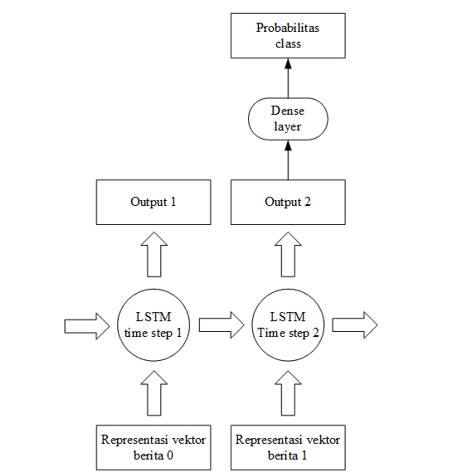

Seperti yang terlihat pada Gambar di atas, vektor dari berita ke-0 diberikan sebagai input LSTM pada time step pertama, dan vektor berita ke-1 diberikan sebagai input LSTM pada time step kedua. Banyak output yang dihasilkan oleh LSTM pada time step terakhir, yakni time step kedua, merepresentasikan sikap berita ke-1 terhadap berita ke-0. Untuk mengartikan representasi tersebut, digunakan dense layer yang mengubah banyak output LSTM tersebut menjadi tiga output. Tiga output ini yang merupakan angka-angka probabilitas label (sikap), di mana angka pertama merupakan angka probabilitas label against, angka kedua merupakan angka probabilitas label observing, dan angka ketiga merupakan angka probabilitas label for. Probabilitas label yang terbesar akan diambil sebagai label untuk kalimat berita terkait tersebut. Untuk mempermudah pengambilan probabilitas terbesar, digunakan juga softmax layer. Pada bagian berikutnya akan dijelaskan masing-masing tahap klasifikasi tersebut.

# LSTM Layer
Pada bagian berikut akan dijelaskan segmen program menggunakan TensorFlow untuk memproses kalimat-kalimat dalam LSTM, disertai dengan contoh beberapa kalimat dan hasil output LSTM-nya.

```python
	rnn_size = 5
	lstm_cell = rnn.CoupledInputForgetGateLSTMCell(rnn_size)
	outputs, final_state = tf.nn.dynamic_rnn(
	    lstm_cell,
	    featured_input,
	    dtype=tf.float32,
	    scope=’rnn_sentences’
	)
```

Segmen program di atas berfungsi untuk memberikan data berisi kumpulan pasangan klaim dan berita terkait, di mana tiap klaim atau berita terkait memiliki vektor representasi kalimat sendiri dan tiap representasinya telah ditambahkan vektor fitur, ke sebuah LSTM. Data/tensor tersebut dinamakan featured_input. Tensor featured_input memiliki bentuk dimensi [?,2,embedding_size], di mana dimensi pertama merupakan pasangan kalimat, dimensi kedua merupakan jumlah kalimat dalam satu pasangan, dan dimensi ketiga merupakan vektor representasi tiap kalimat yang dihasilkan dari proses embedding dan penambahan fitur tambahan. Bentuk dimensi ‘?’ artinya ukuran dapat berbeda-beda berdasarkan jumlah input yang diberi. Sedangkan bentuk dimensi yang berbentuk integer artinya ukuran dimensi selalu berukuran integer tersebut.

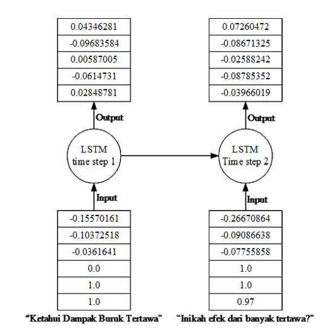

Pada baris ke-2, diinisialisasi sebuah LSTM cell. Karena tiap pasangan kalimat hanya berisi dua kalimat judul berita, maka tiap LSTM cell hanya akan berisi dua LSTM time step. Parameter num_units diisi dengan rnn_size, yang merupakan salah satu parameter training yang dapat diubah-ubah. Dalam contoh ini, diasumsikan rnn_size sebesar 5. Berikut sebuah contoh pasangan kalimat klaim dan berita terkaitnya, beserta vektor representasi masing-masing kalimatnya, seperti yang telah dijelaskan: 
- [Klaim] Ketahui Dampak Buruk Tertawa
    - Vektor: [ -0.15570161, -0.10372518, -0.0361641, 0.0, 1.0, 1.0 ]
- [Berita terkait] Inikah Efek dari Banyak Tertawa?
    - Vektor: [ -0.26670864, -0.09086638, -0.07755858, 1.0, 1.0, 0.97 ]

Berdasarkan contoh pasangan kalimat klaim dan berita terkait tersebut, gambaran LSTM-nya seperti Gambar di atas.

Gambar di atas merupakan gambaran pemrosesan sebuah pasangan kalimat klaim dan berita terkait. Karena sebuah pasangan kalimat hanya berisi dua kalimat, maka LSTM tersebut hanya terdiri atas dua _time step_. Vektor representasi dari kalimat “Ketahui Dampak Buruk Tertawa” yang merupakan sebuah klaim diberikan ke LSTM sebagai input pada time step yang pertama. Vektor representasi dari kalimat “Inikah efek dari banyak tertawa?” yang merupakan berita terkait yang menanggapi kalimat “Ketahui Dampak Buruk Tertawa” diberikan ke LSTM sebagai input pada time step yang kedua.

Masing-masing time step tersebut menghasilkan output sebanyak parameter _rnn_size_, yang mana diasumsikan sebagai 5. Untuk mendapatkan sikap suatu berita terkait, maka diambil output pada time step kedua, yakni output yang dihasilkan dari time step dengan input vektor kalimat berita terkait disertai input dari time step sebelumnya. Output kedua atau yang terakhir ini dihasilkan oleh tensor final_state pada baris ke-3 dari Segmen Program 6.1. Tensor ini menghasilkan output terakhir dari tiap vektor-vektor pasangan kalimat yang diberikan.

# Tracing Branch LSTM
Pada bagian ini akan ditampilkan tracing dari Branch LSTM menggunakan contoh beberapa input. Seperti yang telah dijelaskan pada lstm layer, LSTM menerima 2 vektor input yang akan dipecah menjadi 2 time step, di mana time step pertama diisi dengan representasi kalimat klaim dan time step kedua diisi dengan representasi kalimat salah satu berita terkait yang menanggapi klaim tersebut. Selain input, contoh tracing ini juga akan memberikan contoh label target. Berikut contoh nilai-nilai tersebut:

$$ input x=[ 1.0,0.0] $$
$$ output y=[ 1.0,0.0] $$

LSTM memiliki banyak bobot dan bias dalam hidden state untuk tiap gate. Berikut contoh nilai-nilai bobot dan bias tersebut:

$$ V\tilde{_C} = [0,4] , W\tilde{_C} = [0,4], b\tilde{_C} = [0,4] $$
$$ V_i = [0,2] , W_i = [0,1], b_i = [0,4] $$
$$ V_f = [0,5] , W_f = [0,4], b_f = [0,2] $$
$$ V_o = [0,1] , W_o = [0,5], b_o = [0,3] $$

Setelah ditampilkan contoh nilai-nilai bobot yang terdapat dalam hidden state LSTM, dilakukan perhitungan forward pass. Perhitungan ini dimulai dengan perhitungan untuk tiap nilai gate-nya menggunakan bobot-bobot tersebut. Perhitungan didasarkan pada rumus-rumus pada Bab 2. Perhitungan dilakukan secara urut mulai dari time step pertama. Berikut ditampilkan perhitungan nilai tiap gate-nya.

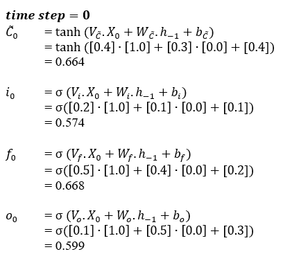

Setelah dihitung masing-masing nilai gate untuk time step pertama, selanjutnya dihitung nilai cell state dan output dari time step pertama berdasarkan nilai-nilai gate tersebut. Berikut perhitungan nilai-nilai output tersebut:

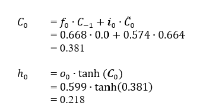

Setelah perhitungan forward pass untuk time step pertama selesai, perhitungan dilanjutkan untuk time step kedua. Berikut perhitungan forward pass untuk time step kedua:

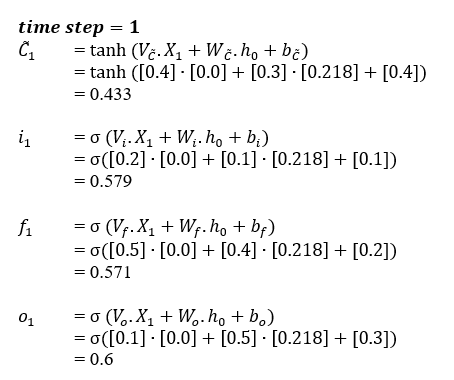

Setelah nilai-nilai gate pada time step kedua selesai dihitung, dihitung hasil output dari time step kedua berdasarkan nilai-nilai gate tersebut beserta input pada time step kedua dan output pada time step pertama. Berikut perhitungan output dari time step kedua:

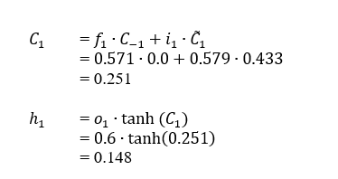

Setelah semua perhitungan forward pass dari time step pertama hingga time step kedua selesai dijalankan, dihitung perhitungan backward pass. Berkebalikan dengan perhitungan forward pass yang menghitung mulai dari time step pertama hingga time step terakhir, perhitungan backward pass dimulai dari time step terakhir hingga time step pertama. Berikut perhitungan backward pass untuk time step kedua:

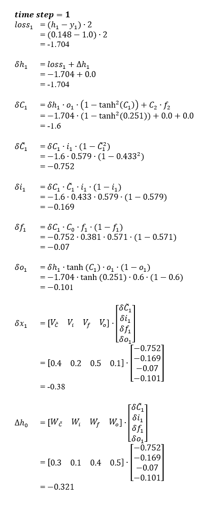

Beberapa rumus backward pass di atas menggunakan nilai-nilai dari time step berikutnya. Karena perhitungan-perhitungan di atas merupakan perhitungan-perhitungan pada time step terakhir, maka nilai-nilai yang seharusnya berasal dari time step berikutnya diisi nilai 0.0. Selanjutnya dilakukan perhitungan untuk backward pass pada time step sebelumnya, yakni yang pertama. Berikut perhitungan-perhitungan tersebut:

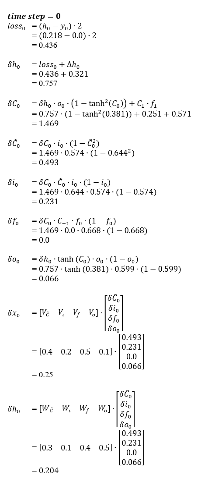

Setelah proses backward pass untuk semua time step telah selesai dijalankan, berikutnya dilakukan perubahan bobot sehingga RNN dapat membuat output yang lebih tepat menggunakan bobot-bobot tersebut. Berikut perhitungan jumlah perubahan bobot:

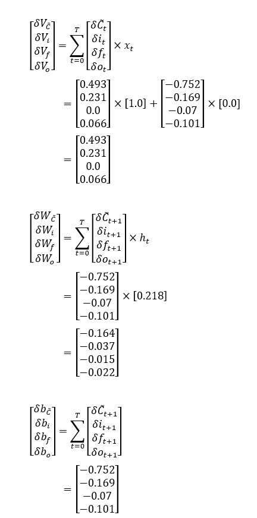

Setelah didapatkan nilai-nilai jumlah perubahan bobot, langkah selanjutnya adalah memperbarui nilai-nilai bobot tersebut dengan nilai-nilai jumlah perubahan bobot tersebut. Untuk memperbarui bobot, digunakan sebuah variabel bernama learning rate (α). Pembaruan nilai bobot dilakukan menggunakan algoritma RMSProp. RMSProp memiliki beberapa variabel tambahan, yakni momentum (β) dan epsilon (ε). Kedua variabel tersebut digunakan untuk mendapatkan nilai dari variabel-lain yang disebut velocity (v). Tiap bobot yang diperbarui memiliki nilai velocity sendiri Berikut inisialisasi nilai-nilai tersebut:


Dengan didefinisikannya variabel-variabel tersebut, proses pembaruan bobot dapat dilakukan. Berikut ditampilkan hasil perhitungan pembaruan bobot beserta velocity untuk tiap bobotnya:

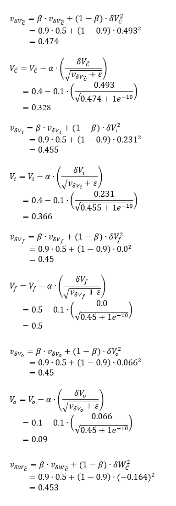

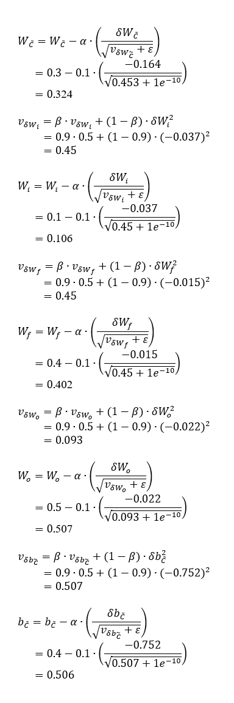 

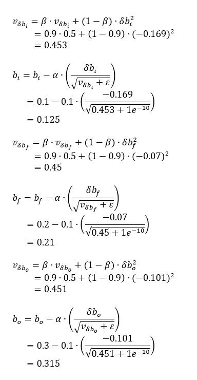

Setelah semua bobot di-update, bobot memiliki pengaruh yang lebih baik terhadap input sehingga input selanjutnya akan memiliki nilai yang lebih dekat dengan targetnya. Setelah proses di atas, perhitungan akan diulang lagi dari dari proses forward pass, backward pass, hingga pembaruan bobot lagi, hingga akhirnya nilai loss mengalami _convergence_.

# Dense Layer and Softmax Layer
Pada bagian ini akan dijelaskan segmen program menggunakan TensorFlow untuk mendapatkan probabilitas label berdasarkan output yang dihasilkan oleh LSTM layer. Proses ini disebut dengan dense layer. Berikut segmen program tersebut:

```python
weights = tf.Variable(tf.truncated_normal(shape=[rnn_size, n_classes]))
biases = tf.Variable(tf.ones([n_classes], dtype=tf.float32))
output = tf.nn.xw_plus_b(final_state.h, weights, biases, name='scores')
softmax_scores = tf.nn.softmax(output)
```

Dense layer membutuhkan weights dan biases sendiri untuk membuat probabilitas label. Weights dan biases tersebut akan mempengaruhi hasil output probabilitas label.

Pada baris pertama dari Segmen Program tersebut, dibuat tensor weights yang akan menghasilkan sebuah matriks berukuran rnn_size * n_classes, di mana rnn_size pada contoh ini diasumsikan sebesar 5, dan n_classes sebesar 3 karena jumlah class label adalah 3 (_against, observing, for_). Isi matriks ini pada awalnya diinisialisasi dengan angka-angka random menggunakan function dari TensorFlow truncated_normal(). Tensor dari function ini menghasilkan nilai-nilai yang mengikuti distribusi normal dengan mean dan standard deviation tertentu.

Pada baris kedua segmen program di atas, dibuat sebuah tensor biases yang akan menghasilkan sebuah vektor dengan ukuran n_classes, yang mana bernilai 3. Tensor ini akan diinisialisasi dengan nilai 1.0 untuk semua nilainya.

Selanjutnya, pada baris ketiga, dibuat tensor yang membuat operasi perkalian matriks antara output LSTM dan weights, di mana output LSTM disimpan dalam tensor final_state.h. Setelah dikalikan dengan weights, hasilnya perkalian tersebut ditambahkan dengan biases. Operasi perkalian dan penambahan ini disimpan dalam tensor output. Hasil dari output ini merupakan probabilitas label.

Berikut contoh output dari output LSTM yang dilewatkan dense layer dengan weights dan biases yang diinisialisasi:

final_state.h: <br>
[-0.03966019, -0.08785352, -0.02588242, -0.08671325,  0.07260472] 

biases:
[1.0, 1.0, 1.0]

output:
[0.7370004, 1.0785755, 0.7917547]

Untuk mendapatkan label yang dihasilkan dari prediksi neural network ini, diambil label dengan probabilitas terbesar. Untuk pengambilan nilai terbesar yang lebih baik, digunakan metode softmax. Softmax mengubah semua nilai probabilitas sehingga semua nilainya akan menghasilkan nilai 1.0 apabila dijumlahkan. Dengan metode ini, pengambilan nilai probabilitas terbesar akan semakin jelas. Operasi softmax ini dibuat dengan nama softmax_scores pada baris ke-4. Berdasarkan contoh output dari dense layer sebelumnya, berikut hasil softmax-nya:

softmax_scores: <br>
 [0.28873   , 0.40628996, 0.30498004] <br>
 against     observing       for


Dari hasil softmax tersebut, nilai yang tertinggi adalah nilai pada indeks ke-1 (0. 40628996), yang artinya kalimat berita terkait pada contoh sebelumnya diklasifikasikan sebagai _observing_.

# Pemanfaatan Loss Function dan Optimizer
_Loss function_ digunakan untuk mengukur seberapa jauh prediksi _neural network_ dengan label target. Untuk tugas klasifikasi stance ini, digunakan cross entropy loss. Cross entropy loss merupakan pengukuran loss terhadap hasil dari softmax layer. Berikut segmen program pengukuran cross entropy loss terhadap prediksi hasil softmax layer:

```python
    target = tf.placeholder(
        tf.float32,
        shape=[None, self.n_classes],
        name='target'
    )
    cost = tf.losses.softmax_cross_entropy(
        onehot_labels=target,
        logits=softmax_scores
    )
```

Segmen program di atas membuat tensor operasi yang melakukan pengukuran nilai loss hasil prediksi yang diberikan. Tensor ini bernama cost. Untuk dapat mengukur nilai loss terhadap hasil-hasil prediksi, dibutuhkan label-label target. Label-label target ini diberikan melalui tensor placeholder target. Label-label target yang diberikan direpresentasikan dalam bentuk one-hot vector. Label against direpresentasikan sebagai [1, 0, 0], label observing sebagai [0, 1, 0], dan label for sebagai [0, 0, 1]. Berdasarkan contoh berita terkait sebelumnya, label target adalah observing. Berikut contoh output loss-nya berdasarkan prediksi softmax sebelumnya:

softmax_scores:
 [0.28873   , 0.40628996, 0.30498004]

target:
 [0.        , 1.        , 0.        ]

cost: 1.0270232

Setelah didapatkan nilai loss dari hasil prediksi terhadap target, dapat dilakukan update terhadap bermacam-macam tensor yang digunakan pada arsitektur neural network ini, seperti weights dan biases pada dense layer, weights dalam LSTM, dan nilai-nilai word embedding. Berikut segmen program untuk melakukan update tersebut:

```python
    learning_rate = 0.01
    train_step = tf.train.RMSPropOptimizer(
        learning_rate
    ).minimize(cost)
```
Segmen program di atas merupakan segmen program untuk membuat tensor yang melakukan optimisasi terhadap tensor-tensor variabel yang sebelumnya dilalui. Optimisasi dilakukan menggunakan _RMSProp_, dengan learning rate 0.01. Tensor ini akan meminimalisasi jumlah error (cost).
